# 🪲 Diabolical-Suture-Engine (DSE)


> "La résilience n'est pas une propriété de la substance, mais une victoire de la géométrie sur la force brute." — **Bryan Ouellette**

## 🌐 Synopsis
Le **Diabolical-Suture-Engine (DSE)** est un framework computationnel conçu pour modéliser et optimiser les interfaces d'assemblage à haute performance. En imitant la suture médiane du coléoptère diabolique (*Phloeodes diabolicus*), capable de supporter 39 000 fois son propre poids, ce moteur remplace les jonctions circulaires classiques par des **lobes ellipsoïdaux à géométrie frustrée**.

[Image de la structure microscopique du Phloeodes diabolicus]

## 🧪 Formalisme Mathématique (Protocole Ouellette)

L'interface est générée via un système d'équations paramétriques ellipsoïdales où la frustration géométrique est introduite par le coefficient d'imbrication $\kappa$.

### 1. Génération de la Courbe Maîtresse
Pour tout $\theta \in [0, 2\pi]$, les coordonnées du lobe sont définies par :

$$x(\theta) = a \cdot \cos(\theta)$$
$$y(\theta) = b \cdot \sin(\theta) \cdot (1 + \kappa \cdot \cos(\theta))$$

Où :
* $a$ : Demi-grand axe (Ratio de largeur).
* $b$ : Demi-petit axe (Profondeur du lobe).
* $\kappa$ : Coefficient d'interverrouillage (Induit la frustration de contrainte).

### 2. Critère d'Optimisation de la Ténacité
L'objectif est de maximiser l'énergie de dissipation $E_{diss}$ par le contrôle du gradient de contrainte $\nabla\sigma$ :
$$\text{Maximize } E_{diss} = \int_{0}^{\epsilon_{f}} \sigma(\epsilon) d\epsilon$$

## 📊 Méthodologie du Projet

```mermaid
graph TD
    A[Analyse: Phloeodes diabolicus] --> B[Modélisation: Paramètres a, b, kappa]
    B --> C[Simulation: geometry_engine.py]
    C --> D[Visualisation: Matplotlib Interface]
    D --> E[Optimisation: Distribution des Contraintes]

```



## 💻 Implémentation

Le cœur du moteur repose sur le script `geometry_engine.py` qui permet une génération instantanée de l'interface optimale :

```python
# Extrait de l'algorithme DSE
def generate_beetle_suture(a, b, kappa, points=200):
    theta = np.linspace(0, 2*np.pi, points)
    x = a * np.cos(theta)
    y = b * np.sin(theta) * (1 + kappa * np.cos(theta))
    return x, y

```

## 📈 Métrologie Comparative

| Géométrie | Force Critique () | Mode de Rupture | Dissipation d'Énergie |
| --- | --- | --- | --- |
| **Circulaire (Standard)** | 80 N | Fragile (Localisée) | Faible |
| **Ellipsoïdale (BGFE)** | **149 N** | **Ductile (Délaminage)** | **Maximale** |

## 🚀 Applications Industrielles

* **Aérospatiale** : Remplacement des rivets par des sutures intégrées dans les fuselages composites.
* **Défense** : Blindages modulaires à dissipation d'énergie par interverrouillage.
* **Bio-médical** : Implants osseux à gradient de rigidité optimisé.

## 🔗 Référence du Manifeste

Ce travail est issu du *Manifeste de la Géométrie Frustrée* (2026) du Dr. Bryan Ouellette, visant à unifier la morphogenèse biologique et l'ingénierie des matériaux.

```

---
